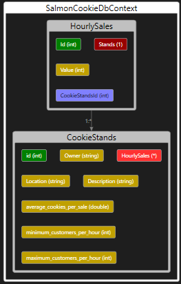

# Cookie Stands API
## Overview
+ This project involves creating an API to manage the operations of Pat's Salmon Cookie Stand. The API will handle CRUD (Create, Read, Update, Delete) operations for the cookie stand locations.

## Database Schema
+ The database schema primarily consists of the following tables:

	- HourlySales: The HourlySales table stores hourly sales data for each cookie stand. Each row corresponds to sales data for one hour at a specific cookie stand.
	- CookieStand: The CookieStand table represents individual cookie stand locations and their details.

## Deployment
+ Check the deployed app here => [CookieStand](https://cookiestandapi.azurewebsites.net)
## ERD 

